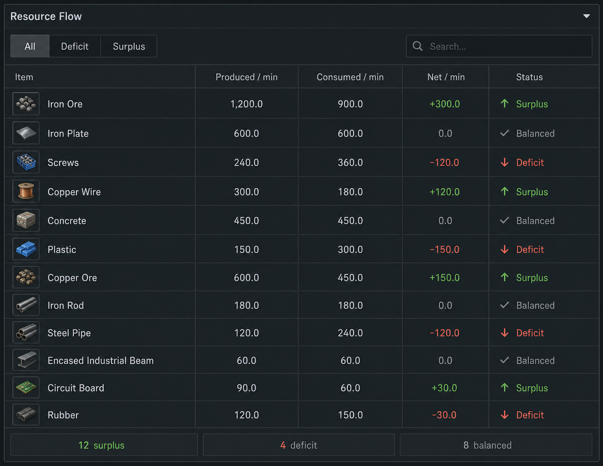

# Resource Flow Implementation Plan

## Summary

Create a focused Resource Flow tool for Ficsit Companion that lists every resource currently produced and consumed by the in-memory graph, then marks each item as deficit, surplus, or balanced.

This first version is calculation and report focused. It does not plan how the feature will connect to the current Ficsit Companion interface.

## Approved Layout



The interface concept is a compact `Resource Flow` panel with:

- Filter controls: `All`, `Deficit`, `Surplus`
- Search field for item names
- Dense resource table
- Small item icon or swatch per row
- Footer summary with counts for surplus, deficit, and balanced resources

## Table Columns

| Column | Meaning |
| --- | --- |
| `Item` | Resource name with icon |
| `Produced/min` | Gross production rate for the item |
| `Consumed/min` | Gross consumption rate for the item |
| `Net/min` | Produced minus consumed |
| `Status` | `Deficit`, `Surplus`, or `Balanced` |

## Calculation Rules

- `net > 0` means surplus.
- `net < 0` means deficit.
- `net == 0` means balanced.
- Use `FractionalNumber` for exact per-minute rates.
- Analyze the current in-memory graph, including imported-save groups.
- Count `CraftNode` inputs as consumed and outputs as produced.
- Count `ExtractorNode` outputs as produced.
- Count `SinkNode` inputs as consumed.
- Recursively analyze `GroupNode` contents so internal production and consumption are visible.
- Do not count `OrganizerNode` or `LogisticsNode` as production or consumption.
- Ignore null item pins and track how many were skipped.

## Proposed Core API

```cpp
enum class ResourceFlowStatus
{
    Deficit,
    Balanced,
    Surplus,
};

struct ResourceFlowRow
{
    const Item* item;
    FractionalNumber produced;
    FractionalNumber consumed;
    FractionalNumber net;
    ResourceFlowStatus status;
};

struct ResourceFlowReport
{
    std::vector<ResourceFlowRow> rows;
    size_t skipped_null_item_pins;
};

ResourceFlowReport BuildResourceFlowReport(const std::vector<std::unique_ptr<Node>>& nodes);
```

## Test Scenarios

- Single craft node reports consumed inputs and produced outputs.
- Craft chain reports gross produced and gross consumed for intermediates.
- Extractor feeding a craft node reduces or removes raw-resource deficit.
- Sink input appears as consumption.
- Splitters, mergers, storage, truck stations, train stations, and dimensional depots do not create fake production or consumption.
- Group and nested group contents are included recursively.
- Fractional rates preserve exact deficit and surplus values.

## Assumptions

- The original generated image remains in its generated-images folder.
- The project-local mockup image is stored at `docs/resource-flow-layout.png`.
- The first implementation should prioritize reusable calculation logic before UI integration.
